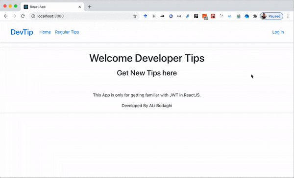

# simple_react_jwt_app

A simple React app demo with JWT authentication

(_this project is only for getting familiar with JWT in react_)

-------

This repository is only contain the frontend part.

The backend part of this app is a NodeJS app that only serve API with JWT login and located [HERE](https://github.com/bodaghialib4/simple_nodejs_jwt_api_backend).

-------

This project implemented according to below Tutorial

[link to the tutorial](https://codesource.io/setting-up-react-authentication-using-jwt/)
